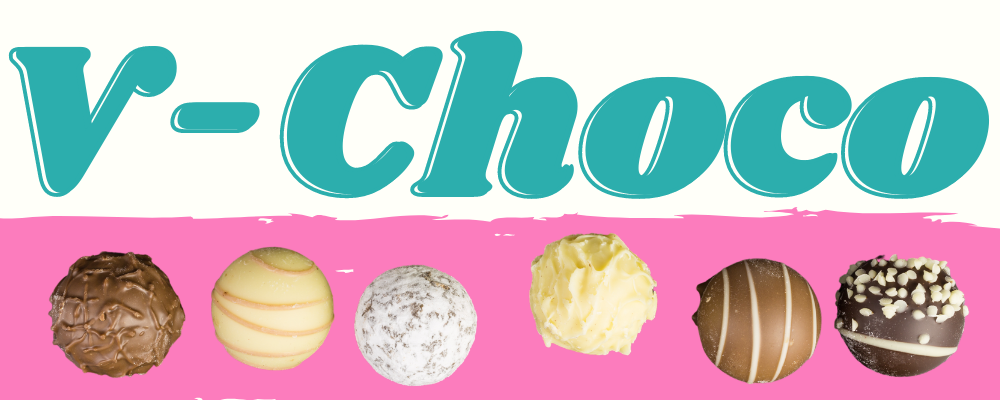
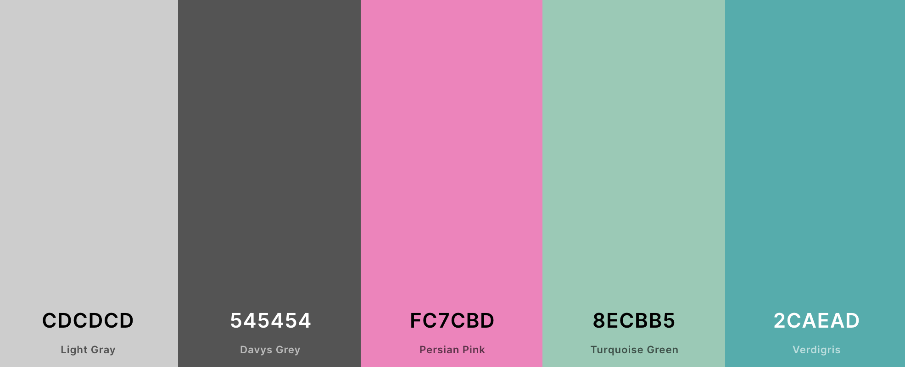

# *V-Choco* - Fourth Milestone Project for Code Institute
*V-Choco* is a webshop that offers dairy-free chocolate for people who are either allergic to dairy or choose to avoid it.

A live preview of the website can be found here: [V-Choco](https://vchoco.herokuapp.com/)

## Table of Contents

1. [UX Design](#ux-design)
    * [User Stories](#user-stories)
    * [Strategy](#strategy)
    * [Scope](#scope)
    * [Structure](#structure)
    * [Skeleton](#skeleton)
1. [Database Structure](#database-structure)
1. [Features](#features)
1. [Technologies Used](#technologies-used)
1. [Testing](#testing)
1. [Deployment](#deployment)
1. [Credits](#credits)
1. [Acknowledgements]#acknowledgements

## UX Design
### User Stories
**Site Visitors**
I want to... | So that I can ...
------------ | -----------------
View all products | choose what I want to purchase
View product details | decide whether I want to purchase this item
View my shopping cart total at any time | make sure I spend the amount I want to spend
Checkout securely | complete my order
Register for an account | easily purchase again in the future
Log in and log out | access my account details and order history
Reset my password if I lost it | access my account again
Receive email confirmations | confirm that I have been registered or that my order was placed
See my order history | reorder products I liked in the past
Post reviews on products I have purchased | share my opinion with others
Sort products by categories | easily select the product I want to purchase

**Site Admin**
I want to... | So that I can ...
------------ | -----------------
Add new products | sell them on the website
Edit product details | keep the website up-to-date
Delete products | remove items from the website that are not in stock
View a list of email subscribers | send emails with the latest news and remove people when asked

### Strategy
The primary goal of this website is to offer users a pleasant and straightforward shopping experience so that they will continue to order from *V-Choco* in the future. In order to accomplish this, the website has a navigation bar with links to all the different products and an overal layout that is common for webshops. The website will also feature a **My Account** section for customers who have registered their details, making future orders quicker to complete.

### Scope
The users need the following from the website:

* A landing page that is easy to navigate.
* A navigation bar with a shopping cart and user section that changes depending on whether the user is logged in or not.
* A register and login form for users to either create a new account or to log in.
* A *My Account* page for users to view their previous orders and default details.
* A *Sign Out* button that is easy to find on every page (preferably in the navigation bar).
* A *Product Details* page for potential customers to decide whether or not they want to purchase the product.
* A reviews section on each *Product Details* page in order to see what previous buyers think about the product.
* A way to sort products by category when viewing all products.
* An option to search the entire site for a specific product.
* An option to add products to the cart.
* A page for viewing/updating/removing the contents of the shopping cart and with a button to go to the checkout page.
* A secure checkout form to complete orders.
* A confirmation page and email when an order has been placed.
* The ability to review products when signed in.

### Structure

Django was used for this project in order to make an interactive full-stack website that shows users different content depending on their activity.

A traditional navigation bar was implemented at the top of each page with the common "Tree Structure". This menu changes depending on whether a user is currently logged in. If so, it includes links to the Home, Products, My Account, Cart, and Log Out pages. If not, it includes links to the Home, Products, Log In, Register, and Cart pages.

Color Scheme: The background of the website and navigation bar are both white. This neutral base is needed as the other colors on the website are quite bright. Dark grey is used for all of the font on the website. All of the buttons are white and light grey when hovered over. The free shipping banner, reviews carousel on the homepage, and product cards on the products page, are all pink. The navbar font and logo font are a light sea-green and a darker sea-green when hovered over. The alert messages are the standard bootstrap info, danger and success colors (blue, red and green).

**Typography:** [Karla](https://fonts.google.com/specimen/Karla) was used for the entire website.

**Icons:** Icons from [FontAwesome](https://fontawesome.com/) were used in the navigation bar for the user account and shopping cart links to minimize text used. Buttons across the site also have FontAwesome icons. 

### Skeleton
[Click here](static/wireframes) to see all wireframes for this project.

*Please note that the wireframes show the initial design ideas for the website and therefore may not match the current version.*

[Back to Top](#table-of-contents)

## Database Structure

### Marketing App

The model in this app allows users to sign up to the newsletter on the website.

**Newsletter Signups Model**
Name | Database Key | Field Type | Validation
---- | ------------ | ---------- | -----------
Email | email | EmailField | unique=True
Time Added | timestamp | DateTimeField | auto_now_add=True

### Profiles App

The model in this app allows users to create an account and save their default shipping address.

**User Profile Model**
Name | Database Key | Field Type | Validation
---- | ------------ | ---------- | -----------
User | user | OneToOneField | User, on_delete=models.CASCADE
Full Name | default_full_name | CharField | max_length=50, null=True, blank=True
Address 1 | default_street_address1 | CharField | max_length=80, null=True, blank=True
Address 2 | default_street_address2 | CharField | max_length=80, null=True, blank=True
Town or City | default_town_or_city | CharField | max_length=40, null=True, blank=True
Postcode | default_postcode | CharField | max_length=20, null=True, blank=True
County | default_county | CharField | max_length=80, null=True, blank=True
Country | default_country | CountryField | blank_label="Country", null=True, blank=True
Phone Number | default_phone_number | CharField | max_length=20, null=True, blank=True

### Products App

The models in this app store all the products and their reviews on the website.

**Category Model**
Name | Database Key | Field Type | Validation
---- | ------------ | ---------- | -----------
Name | name | CharField | max_length=254
Friendly Name | friendly_name | CharField | max_length=254, null=True, blank=True

**Product Model**
Name | Database Key | Field Type | Validation
---- | ------------ | ---------- | -----------
Category | category | ForeignKey | 'Category', null=True, blank=True, on_delete=models.SET_NULL
SKU | sku | CharField | max_length=254, null=True, blank=True
Name | name | CharField | max_length=254
Description | description | TextField | 
Price | price | DecimalField | max_digits=4, decimal_places=2
Image URL | image_url | CharField | max_length=1024, null=True, blank=True
Image | image | ImageField | null=False, blank=False

**Product Review Model**
Name | Database Key | Field Type | Validation
---- | ------------ | ---------- | -----------
Product | product | ForeignKey | Product, related_name="reviews", on_delete=models.CASCADE
User | user | ForeignKey | User, related_name="reviews", on_delete=models.CASCADE
Content | content | CharField | max_length=254, null=True, blank=True
Rating | rating | IntegerField | 
Date Added | timestamp | DateTimeField | auto_now_add=True

### Checkout App

The models in this app allow users to add products to their cart and create an order.

**Order Line Item Model**
Name | Database Key | Field Type | Validation
---- | ------------ | ---------- | -----------
Order Number | order | ForeignKey | Order, null=False, blank=False, on_delete=models.CASCADE, related_name='lineitems'
Product | product | ForeignKey | Product, null=False, blank=False, on_delete=models.CASCADE
Quantity | quantity | IntegerField | null=False, blank=False, default=0
Line Item Total | lineitem_total | DecimalField | max_digits=6, decimal_places=2, null=False, blank=False, editable=False

**Order**
Name | Database Key | Field Type | Validation
---- | ------------ | ---------- | -----------
Order Number | order_number | CharField | max_length=32, null=False, editable=False
User Profile | user_profile | ForeignKey | UserProfile, on_delete=models.SET_NULL,null=True, blank=True, related_name='orders'
Full Name | full_name | CharField | max_length=50, null=False, blank=False
Email | email | EmailField | max_length=254, null=False, blank=False
Phone Number | phone_number | CharField | max_length=20, null=False, blank=False
Country | country | CountryField | blank_label="Country *", null=False, blank=False
Postcode | postcode | CharField | max_length=20, null=True, blank=True
Town or City | town_or_city | CharField | max_length=40, null=False, blank=False
Address 1 | street_address2 | CharField | max_length=80, null=False, blank=False
Address 2 | street_address2 | CharField | max_length=80, null=True, blank=True
County | county | CharField | max_length=80, null=True, blank=True
Date | date | DateTimeField | auto_now_add=True
Shipping Cost | shipping_cost | DecimalField | max_digits=6, decimal_places=2, null=False, default=0
Subtotal | total | DecimalField | max_digits=10, decimal_places=2, null=False, default=0
Grand Total | grand_total | DecimalField | max_digits=10, decimal_places=2, null=False, default=0
Original Cart | original_cart | TextField | null=False, blank=False, default=''
Stripe ID | stripe_pid | CharField | max_length=254, null=False, blank=False, default=''

[Back to Top](#table-of-contents)

## Features
### Existing Features
#### Navigation Bar
#### Landing Page
#### Registration Form
#### Sign In/Sign Out Form
#### My Account Page
#### Products and Product Details Pages
#### Add a Product Page
#### Edit a Product Page
#### Shopping Cart
#### Checkout Page
#### Order Confirmation Page
### Hopeful Future Features

[Back to Top](#table-of-contents)

## Technologies Used
### Languages
* [HTML5](https://developer.mozilla.org/en-US/docs/Web/HTML)
* [CSS3](https://developer.mozilla.org/en-US/docs/Web/CSS)
* [Javascript](https://www.javascript.com/)
* [Python](https://www.python.org/)
* [Jinja2](https://jinja.palletsprojects.com/en/2.10.x/)

### Libraries/Frameworks
* [Django](https://www.djangoproject.com/) : Main web framework used.
* [Bootstrap](https://www.getbootstrap.com/) : Used for initial styling and in order to create a uniform website that renders well on all screen sizes. Also used for some basic Javascript additions.
* [Jquery](https://jquery.com/) : Used in a lot of the bootstrap styling and additional Javascript on the website.
* [Google Fonts](https://fonts.google.com/) : Used for the font on the website.
* [Font Awesome](https://fontawesome.com/) : Used for social media icons.

### Tools
* [Visual Studio Code](https://code.visualstudio.com/) : The code editor used for this project.
* [Git](https://git-scm.com/) : Installed on VS Code to allow version control.
* [Balsamiq Mockups](https://balsamiq.com/) : Used to create the wireframes during the UX Design process.
* Chrome Developer Tools: Used to test the website while developing.
* [W3C Markup Validation Jigsaw](https://jigsaw.w3.org/css-validator/) : To validate the CSS code.
* [W3C Markup Validation](https://validator.w3.org/) : To validate the HTML code.
* Github : Used to host the repositories for this project.
* [Canva](https://www.canva.com/) : Used to resize images and create logo.
* [Heroku](https://heroku.com/) : Used to host the website.
* [AllAuth](https://django-allauth.readthedocs.io/en/latest/installation.html): Used for user registration and authentication. 
* [Crispy-Forms](https://django-crispy-forms.readthedocs.io/en/latest/) : Used to build the forms on the website
* [Gunicorn](https://gunicorn.org/) : A Python WSGI HTTP server required for deploying to Heroku
* [Boto3](https://pypi.org/project/boto3/) : Required to set up and manage AWS services, like S3.
* [Psycopg2](https://pypi.org/project/psycopg2-binary/) : Needed for the Postgres database
* [Pillow](https://pillow.readthedocs.io/en/stable/) : Required for images with Python interpreter 
* [AWS S3 Bucket](https://aws.amazon.com/s3/) : Used to store the media and static files
* [Stripe](https://stripe.com/) : Used to process payments and webhooks on the checkout page

### Databases
* [SQlite3](https://www.sqlite.org/index.html) - The database used when in development
* [PostgreSQL](https://www.postgresql.org/) - The database used when deployed to Heroku

[Back to Top](#table-of-contents)

## Testing
### Validation Testing
### User Stories Testing
### Manual Testing

[Back to Top](#table-of-contents)

## Deployment

*V-Choco* has been built with the help of Visual Studio Code, a desktop code editor. It has been committed to Git and Pushed to GitHub using the terminal in Visual Studio Code. the website is hosted on Heroku.

### Cloning
**Clone the repository and run locally:**
1. Navigate to the repository from the Github Dashboard
1. Select the green button in the top right of the screen that says "Clone or download"
1. Click on the clipboard icon to the right of the URL to copy it
1. Open an Integrated Development Environment (IDE) and head over to the terminal
1. Change the directory to where you want to clone the repository to
1. Execute the following command by pasting in the URL you copied in step 3: git clone https://github.com/debrawolford/v-choco.git
1. Press Enter
1. The site will then be cloned
1. Install all the project dependencies by typing pip install -r requirements.txt
1. Create an env.py file in your root directory.
1. Add env.py file to the.gitignore file.
1. Add the following to your env.py file with the applicable variables:

KEY | VALUE
--- | -----
DATABASE_URL | Your database url
SECRET_KEY | Your secret key that you used for your Django project
STRIPE_PUBLIC_KEY | Obtained from Stripe
STRIPE_SECRET_KEY | Obtained from Stripe
STRIPE_WH_SECRET | Obtained from Stripe

### Deploying on Heroku
1. Follow the steps above to clone your project.
1. Go to your Dashboard in Heroku and select New -> Create New App.
1. Give your app a name and select your region.
1. Go to the Resources tab and search for Postgres, select it as a free add-on.
1. Add the following Config Vars in the settings tab:

KEY | VALUE
--- | -----
DATABASE_URL | Your Postgres database url
SECRET_KEY | Your secret key that you used for your Django project
STRIPE_PUBLIC_KEY | Obtained from Stripe
STRIPE_SECRET_KEY | Obtained from Stripe
STRIPE_WH_SECRET | Obtained from Stripe

1. Go to the Deploy tab and select GitHub as your Deployment method.
1. Follow the instructions to connect to the correct Github repository.
1. Enable Automatic Deploys. This will deploy the website each time the master branch is updated.
1. If you prefer to deploy manually, head to the Manual Deployment section, choose the master branch, and select Deploy.
Your website should now be live.

### Sending Confirmation Email through Gmail
To send the registration and order confirmation emails, you will need to set up a gmail account and enable two-step authentication in your security settings and set up an app password. Once you have these you will need to set the following in your Heroku config vars:

KEY | VALUE
--- | -----
EMAIL_HOST_PASS | The password you created in App Passwords
EMAIL_HOST_USER | Your Gmail account (...@gmail.com)

### Hosting your files on AWS
The static and media files for this website are saved in an AWS S3 Bucket. In order to deploy this project, you will need to create an AWS account and then set up your AWS S3 Bucket, making sure you allow public access. Once you have done this, you will need to add the following to your Heroku config vars:

KEY | VALUE
--- | -----
AWS_ACCESS_KEY_ID | Given to you while setting up your bucket
AWS_SECRET_ACCESS_KEY | Given to you while setting up your bucket
USE_AWS | True

[Back to Top](#table-of-contents)

## Credits
### Content

I initially followed along with the Boutique Ado mini project from Code Institute to create the first few models of my site.

I roughly followed the tutorial by [Yuksel CELIK, PhD](https://www.youtube.com/watch?v=OvTs8BMLb7o) for setting up the product reviews models. It was later adapted to suit my project.

### Media

All the images on this website were created using [Canva](https://www.canva.com/), a website that lets you create content with a library of stock images.

[Back to Top](#table-of-contents)

## Acknowledgements

Thanks to my mentor, Dick Vlaanderen for providing helpfulfeedback throughout the project.

Thanks to the Slack community for helping me resolve some errors while deploying.

[Back to Top](#table-of-contents)